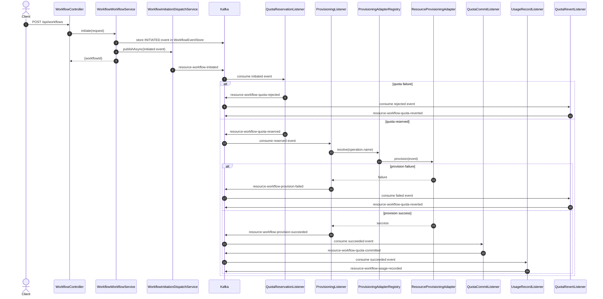

# Resource Workflow Flow

This document explains the event flow for the resource provisioning saga.
The same flow works for `VM`, `STORAGE`, and `FLOATING_IP`.
The provider is selected at runtime from `operation.name` and routed through a provisioning adapter.
The first publish is dispatched asynchronously, and the HTTP API returns only the `workflowId`.

## High-Level Flow



## Event Topics

- `resource-workflow-initiated`
- `resource-workflow-quota-reserved`
- `resource-workflow-quota-rejected`
- `resource-workflow-provision-succeeded`
- `resource-workflow-provision-failed`
- `resource-workflow-quota-committed`
- `resource-workflow-quota-reverted`
- `resource-workflow-usage-recorded`

## Classes Involved

- [`WorkflowController`](src/main/java/com/example/kafkaexmaple/workflow/controller/WorkflowController.java) receives the API request.
- [`WorkflowWorkflowService`](src/main/java/com/example/kafkaexmaple/workflow/service/WorkflowWorkflowService.java) creates the `workflowId`, stores the first event, and kicks off the async dispatch.
- [`WorkflowInitiationDispatchService`](src/main/java/com/example/kafkaexmaple/workflow/service/WorkflowInitiationDispatchService.java) performs the asynchronous first publish.
- [`WorkflowEventPublisher`](src/main/java/com/example/kafkaexmaple/workflow/service/WorkflowEventPublisher.java) writes workflow events to Kafka.
- [`QuotaReservationListener`](src/main/java/com/example/kafkaexmaple/workflow/listener/QuotaReservationListener.java) handles the first business step.
- [`ProvisioningListener`](src/main/java/com/example/kafkaexmaple/workflow/listener/ProvisioningListener.java) handles resource creation orchestration.
- [`ProvisioningAdapterRegistry`](src/main/java/com/example/kafkaexmaple/workflow/provider/ProvisioningAdapterRegistry.java) resolves the correct cloud adapter.
- [`ResourceProvisioningAdapter`](src/main/java/com/example/kafkaexmaple/workflow/provider/ResourceProvisioningAdapter.java) is the provider strategy interface.
- [`OpenStackProvisioningAdapter`](src/main/java/com/example/kafkaexmaple/workflow/provider/OpenStackProvisioningAdapter.java), [`VmwareProvisioningAdapter`](src/main/java/com/example/kafkaexmaple/workflow/provider/VmwareProvisioningAdapter.java), and [`HuaweiProvisioningAdapter`](src/main/java/com/example/kafkaexmaple/workflow/provider/HuaweiProvisioningAdapter.java) are the provider implementations.
- [`QuotaCommitListener`](src/main/java/com/example/kafkaexmaple/workflow/listener/QuotaCommitListener.java) finalizes quota after success.
- [`UsageRecordListener`](src/main/java/com/example/kafkaexmaple/workflow/listener/UsageRecordListener.java) records usage after success.
- [`QuotaRevertListener`](src/main/java/com/example/kafkaexmaple/workflow/listener/QuotaRevertListener.java) undoes quota after failure.
- [`WorkflowEventStore`](src/main/java/com/example/kafkaexmaple/workflow/store/WorkflowEventStore.java) keeps a trace of emitted and consumed events.

## Request Payload

```json
{
  "operation": {
    "name": "os_create_vm",
    "type": "instance_creating",
    "contractId": 1169,
    "productId": 2,
    "providerId": 33,
    "parameters": {
      "name": "rebuiltMain",
      "password": "",
      "flavorRef": "2d6efff7-3ede-4382-9a98-ac80d7023b19",
      "imageRef": "7e21d3e2-e5e3-4a1f-b61e-4d3d93125399",
      "block_device_mapping_v2": [
        {
          "boot_index": 0,
          "destination_type": "volume",
          "source_type": "image",
          "uuid": "7e21d3e2-e5e3-4a1f-b61e-4d3d93125399",
          "volume_size": 20,
          "volume_type": "ce6d88d0-cae5-430a-b0dd-215de1d6f79d",
          "updatedSize": 20,
          "productVolumeType": "9072"
        }
      ],
      "metadata": {},
      "networks": [
        {
          "uuid": "0b6fb720-e2ef-46ae-a849-eaead8a8063b"
        }
      ],
      "mode": "quickStart",
      "security_groups": [],
      "user_data": "",
      "availability_zone": "nova",
      "project_id": "12e2844e83d343b9be88bce89866b6d0",
      "productImageRef": "9069",
      "productFlavorRef": "9070",
      "billingMode": "payg"
    },
    "region": "California",
    "otherParameters": "{}"
  },
  "simulateProvisionFailure": false,
  "simulateQuotaFailure": false
}
```

## How The Flow Works

1. The client calls `POST /api/workflows`.
2. The API creates a `workflowId`.
3. The service stores the initiated event in `WorkflowEventStore`.
4. The initiation dispatch service publishes the `initiated` event asynchronously.
5. The API returns `{"workflowId":"..."}` immediately.
6. The quota listener reserves quota or rejects the request.
7. If quota is reserved, the provisioning listener resolves the provider adapter and starts the resource.
8. If provisioning succeeds, quota is committed and usage is recorded.
9. If provisioning fails, quota is reverted.

## Failure Simulation

- `simulateQuotaFailure = true` stops the flow at quota reservation.
- `simulateProvisionFailure = true` allows quota reservation, then fails during provisioning.

## Event Store Purpose

`WorkflowEventStore` is not the workflow engine. It is an in-memory trace of the saga:

- it records the initial API event
- it records each listener handoff
- it powers `/api/workflows/events`

Kafka topics are still the actual transport and source of workflow progression.

## Why This Design

This is a saga style flow. It is better than a single synchronous call because:

- each step is explicit and observable
- failure compensation is separated from success handling
- the same pattern works for VM, storage, and floating IP
- retry and dead letter handling can be added later without redesigning the API
